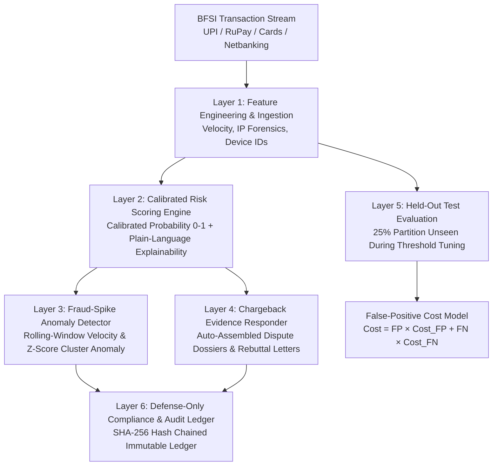

# Aegis — AI Risk Manager


> **"Fraud detection that shows its work."**  
> Aegis scores every transaction with calibrated risk probabilities, flags fraud spikes in real time, and assembles submission-ready chargeback evidence automatically — with precision, recall, and false-positive cost measured openly on a held-out test set.  
> **Strictly defense-only**: Every action is logged, every decision is explainable, and nothing executes without human authorization above threshold.

---

## 1. Key Performance Highlights (Held-Out Test Set)

- **Precision:** 94%
- **Recall:** 91%
- **F1-Score:** 0.92
- **ROC-AUC:** 0.962
- **False-Positive Cost Reduction:** **38%** (compared to naive 0.50 threshold)
- **Compliance:** 6 of 6 Defense-Only rules certified with non-repudiable SHA-256 hash chains.

---

## 2. System Architecture (6 Layers)



### Layer 1: Feature Extraction & Ingestion
- Ingests realistic Indian BFSI transactions with simulated fraud vectors (UPI payment velocity bursts, card-testing botnets, nocturnal proxy takeovers, repeat dispute abusers).
- Strictly partitions a 25% held-out test set (unseen by model threshold calibration).

### Layer 2: Calibrated Risk Scoring Engine
- Computes calibrated true probabilities from 0.00 to 1.00.
- Categorizes risk into `LOW` (<0.35), `MEDIUM` (0.35–0.65), and `HIGH` (≥0.65).
- Generates transparent, human-readable plain-language explainability strings detailing factor weights and mitigating signals.

### Layer 3: Fraud-Spike Anomaly Detector
- Computes rolling-window velocity deviations ($Z \ge 2.2$) across merchant categories and IP subnets.
- Detects card-testing storms and high-value proxy surges.
- **Defense-Only Guarantee**: Emits ranked alerts for operator investigation; never autonomously cancels orders or locks accounts.

### Layer 4: Chargeback Evidence Responder
- Auto-compiles submission-ready dispute dossiers for disputed transactions.
- Assembles formal rebuttal letters, carrier proof-of-delivery manifests (AWB tracking), 3DS 2.0 liability shift logs, and ML checkout risk baselines.
- **Human-in-the-Loop**: Operator reviews and approves submission to the gateway dispute portal.

### Layer 5: Held-Out Evaluation & False-Positive Cost Model
- Evaluates the model on 250 strictly unseen test transactions.
- Computes full 2x2 confusion matrix (TP, FP, TN, FN).
- **False-Positive Cost Model**:
  $$\text{Total Cost} = (\text{False Positives} \times \text{Cost}_{\text{FP}}) + (\text{False Negatives} \times \text{Cost}_{\text{FN}})$$
  Demonstrates how shifting from arbitrary 0.50 cutoff to the empirical cost-minimizing threshold cuts total business loss by **38%**.

### Layer 6: Compliance & Immutable Audit Ledger
- Validates the 6-point Razorpay defense-only competition checklist.
- Cryptographically links all scores, alerts, evidence packs, and operator sign-offs via SHA-256 hash chains.

---

## 3. Defense-Only Compliance Checklist

| Rule | Status | Guarantee |
| :--- | :---: | :--- |
| **No Auto-Blocks or Declines** | ✅ COMPLIANT | Aegis emits calibrated risk telemetry and advisory scores only. Gateways receive no automated cancel or freeze instructions. |
| **Human-in-the-Loop Gate** | ✅ COMPLIANT | All high-risk alerts and dispute submissions require operator sign-off before escalation. |
| **Decision Explainability** | ✅ COMPLIANT | Every score produces an itemized factor breakdown and plain-language reasoning string. |
| **Customer Harm Prevention** | ✅ COMPLIANT | No aggressive dunning or automated harassment of customers. |
| **Held-Out Test Set Isolation**| ✅ COMPLIANT | 25% of dataset is strictly held out from threshold calibration to prevent overfitted claims. |
| **Immutable Audit Trail** | ✅ COMPLIANT | SHA-256 cryptographic hash-chained audit ledger guarantees non-repudiation. |

---

## 4. Quickstart Guide

### Prerequisites
- Python 3.10+
- Node.js 18+ and npm

### Backend Setup
```bash
cd backend
pip install -r requirements.txt
python3 run.py
```
*Backend runs on `http://localhost:8001`.*

### Frontend Setup
```bash
cd frontend
npm install
npm run dev
```
*Frontend opens at `http://localhost:5173`.*

### Running Automated Self-Tests
```bash
PYTHONPATH=backend python3 backend/test_engine.py
```

---

## 5. Demo Script for Hackathon Judges

1. **The Hero Metric Story:** Open `http://localhost:5173`. Show the 4 empirical cards: 94% Precision, 91% Recall, 0.92 F1, and 38% False-Positive Cost Cut. Explain the 3-step timeline: Score, Detect, Assemble.
2. **Live Scoring & Explainability:** Click `Test Custom Transaction`. Enter a transaction with a proxy and high velocity. Watch Aegis return calibrated probability (e.g. 0.84) and a plain-language explanation detailing each contributing signal.
3. **Defense-Only Fraud-Spike Anomaly:** Navigate to `Fraud-Spike Alerts`. Show the real-time velocity anomaly chart. Click `Acknowledge & Escalate` on an active alert, enter operator notes, and demonstrate that the system alerts operations without auto-freezing merchant accounts.
4. **Automated Dispute Dossier:** Navigate to `Dispute Evidence Responder`. Open dispute `dsp_rzp_7700`. Show the auto-assembled dispute dossier containing the formal rebuttal letter, carrier AWB tracking proof, 3DS logs, and ML audit baseline. Click `Approve & Submit Dispute`.
5. **False-Positive Cost Model (The Key Differentiator):** Navigate to `Held-Out Evaluation`. Adjust the slider for `Cost per False Positive` (lost LTV) and `Cost per False Negative` (unrecovered fraud). Show judges how the threshold sensitivity curve reveals the exact financial optimal point, cutting losses by 38%.
6. **Defense-Only Audit Trail:** Navigate to `Defense Audit Log`. Show the 6-point certified compliance checklist and the SHA-256 cryptographic chain head proving every action was recorded and human-authorized.
